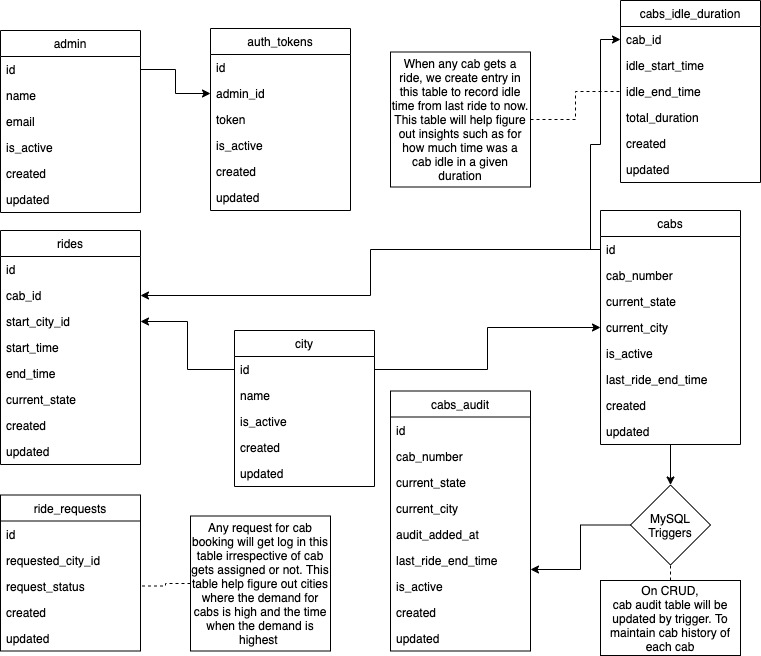

# cab-management-portal

### Installation steps

```
Go 1.12 Required
1. Clone the project
2. Update app/utilEntities/config.go with mysql config
3. run -> go mod vendor
4. run -> go build -mod=vendor 
5. run -> export APP_NAME=test_app;TIER=dev;PORT=8080 //Environment variable
6. run -> ./cab-management-portal
```

### DB Design


### POSTMAN COLLECTION
https://www.getpostman.com/collectisons/85afb79fc87848529e86


### PENDING IMPROVEMENTS
1. Implement DB/Cache based admin authentication
2. API for how much time was a cab idle in a given duration
3. Better error handling for DB level and Controller level errors
4. Unit test cases for all the controllers
5. On start of server, create DB tables if not already exist